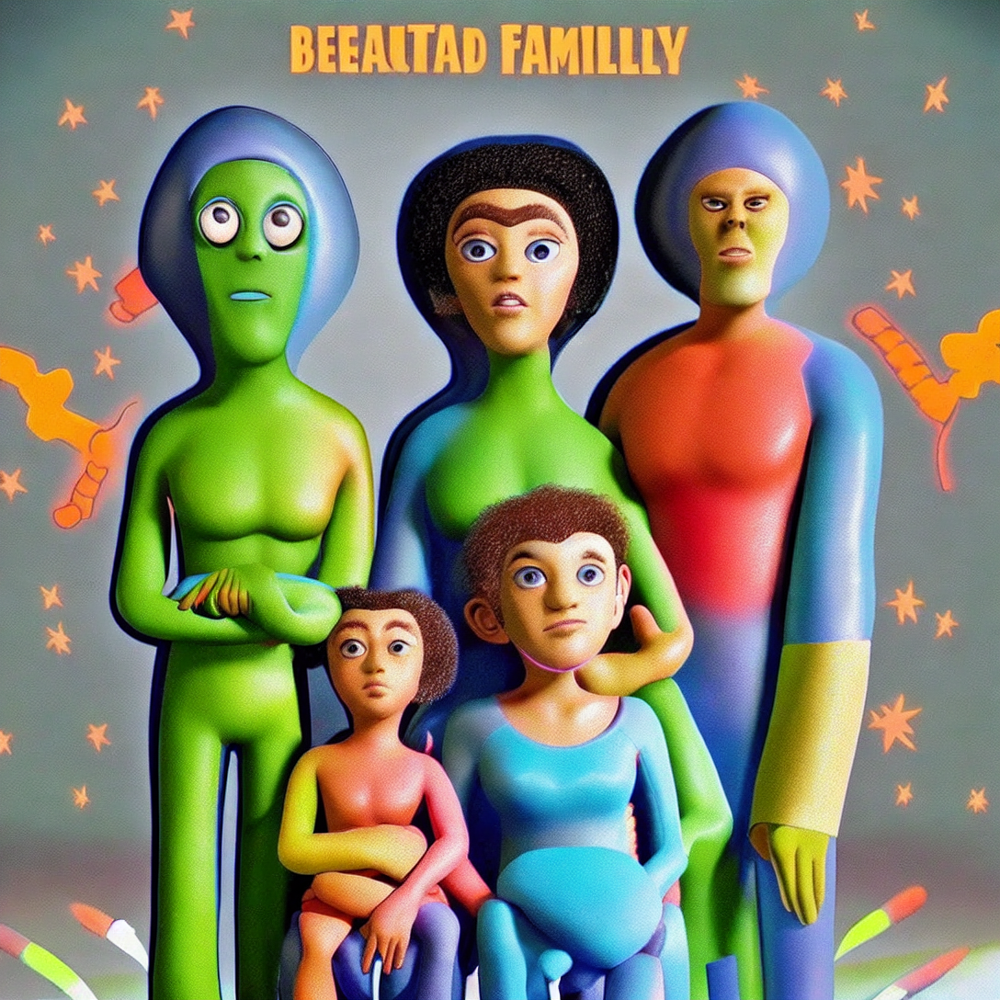

# cv-project-hotels
# Image and preferences of the aliens:
* It is difficult to imagine how would aliens look like as noone has ever seen them but I have tried to generate some images of aliens with stable diffusion network. Here are some images:
First of them shows a typical alien generated with stable diffusion - a blue one with big eyes and hair (??). That alien was supposed to be a beutiful one so the network thought it will have a colourful mask.

Secondly, the network generated that alien:

 ..But it looked quite ugly so I tried next. That looks much better! And it is finally good. I suppose, that will be a perfect quest of the diffused hotel!
 
  Then I tried to generate a family of aliens who will be quests:
  
  They looked strange and too grotesque for typical quests.
  Next the network finally generated a perfet family of aliens. They are minimalistic, perfectly coloured and small enough to fit into every room.
  
   After all these expiriments I used Kandinskiy 2.2 network to observe how it can generate a family of aliens and hotel rooms.
   Alien family:
   
  That family looks a way more detailed, however, it is kinda non-acceptable for a public discussion so I would rather stand for a more minimalistic pink family.
  Hotel for aliens:
  
  It looks, in my opinion, absolutely perfect for aliens as it is sci-fi and perhaps reminds aliens of their home planets.
  Next I tried to create an image of a hotel for aliens:
  
  It also reminds of scientific movies and represents a lifestyle of aliens, so, I suppose, it will suit our quests.
  Stable diffusion (online vesion) generated a worse variation:
  
  I don't understand the reason there are some small brown houses surrounding the hotel so the first image seems to look better.
# Dataset observation:
1. What is image captioning?
   Is the prediction of caption for a given image. Image captioning is describing images to people, generating text description to an image. It involves both CV and NLP as language models. 
2. Why people are working on it?
   Because image captioning can help people to do many real-world applications, such as image search, as an example, by providing a description of visual content in order to clearly understand the context.
3. What is the main principle of the task?
   Image captioning is used both for NLP and CV tasks such as image classification, image detection etc. The basic principle after this is usage of Vision Transformer for computer vision tasks. The idea is that Vision Transformer architecture splits the image into fized-size patches, which are flattened and after that lower- dimensional embeddings are created from these patches.
# Dataset overview:
1. Image content:
   Images consist of 
